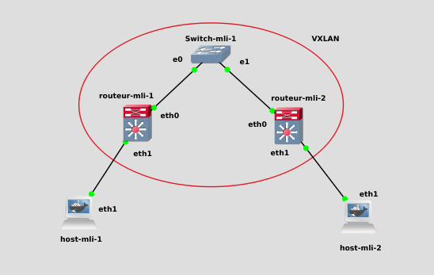
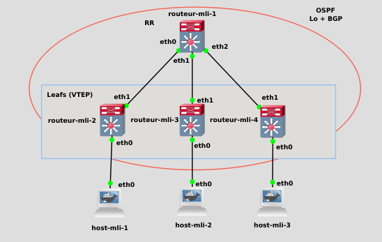

# at42Badass

The purpose of this network-admin project is to simulate several networks in GNS3 with Docker images.

The project is split in three parts that runs inside a VM.

## Start the VM

We are using a qemu virtual machine with debian11. \
Everything is setup automatically by this [Makefile](./Makefile)

After the VM installation, you will have to copy this repo inside in order to [setup](setup.sh) by installing GNS3 and docker. And finally build the docker images with this [Makefile](./images/Makefile).

## Part 1: GNS3 and Docker

This part is just about introduicing GNS3 while using custom docker images. \
Still, we had to create a docker image with some daemons up (Zebra, BGPD, OSPFD, ISISD).

You can import the [GNS3 Project](P1/P1.gns3project)

## Part 2: Basic VXLAN

This part is about being able to ping a machine from an other through a VXLAN.

You can import the [GNS3 Project](P2/P2-static.gns3project)

## Part 2: BGP-EVPN

This part is about being able to ping a machine from an other through a EVPN. \
It also contains a Route Reflector (RR), and three VTEPs.

The routing informations are automatically shared by the BGP protocol.

You can import the [GNS3 Project](P3/P3.gns3project)

